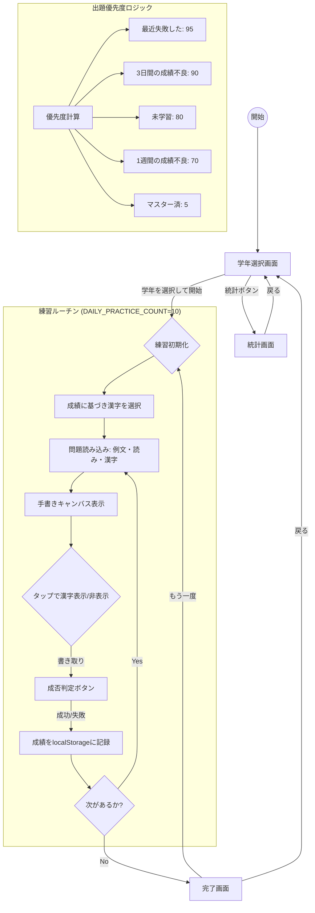

# 漢字練習アプリ - 常用漢字2136

常用漢字2136字を学年別に練習できるウェブアプリケーションです。
成績に基づいた優先度付きの出題アルゴリズムと、手書きキャンバス機能を備えています。

## アプリケーションフロー (Flowchart)

## 主な機能

- **学年別選択**: 小学校1年〜6年、および中学・高校の常用漢字を網羅。
- **インテリジェント出題**: 
    - `localStorage`に保存された過去の正解・不正解履歴から優先度を計算。
    - 苦手な漢字や未学習の漢字を優先的に出題。
    - 1週間ミスがない漢字は「習得済」として優先度を下げ、効率的な学習を支援。
- **手書きキャンバス**: マウスやタッチ操作で漢字を実際に書いて練習可能。
- **統計表示**: 学年ごとの習得率や、漢字ごとの詳細な成績を確認可能。

## 技術スタック

- **Frontend**: HTML5, CSS3 (Vanilla), JavaScript (ES6+)
- **Storage**: Browser LocalStorage
- **Design**: Google Fonts (Noto Sans JP, Zen Maru Gothic)
